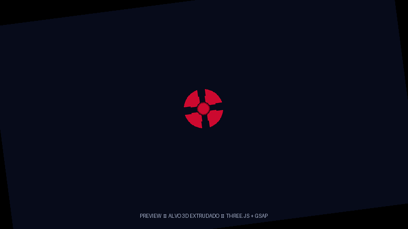
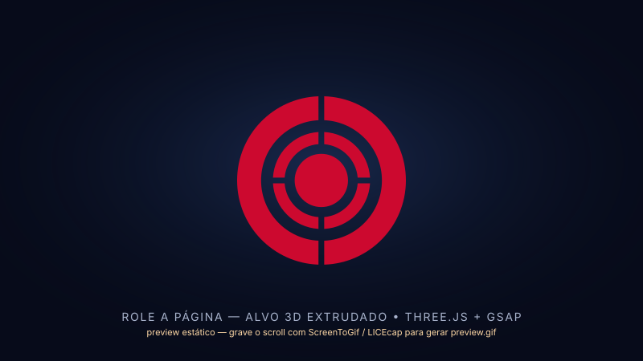

# 🎯 Protótipo — Ícone Dinâmico 3D no Scroll

> Um alvo vermelho que nasce do centro, ganha espessura real e gira em 3D conforme você rola a página. Feito com o seu SVG exato, sem aproximações.

 • Single-file • Sem build • 60fps

> **Preview:** `preview.gif` (grave rolando a página) e `preview.png` (frame estático). Se o GIF não carregar, abra o `index.html`.

<p align="center">
  
  <br/>
  <em>Frame estático — no scroll ele gira e ganha espessura</em>
</p>

<details>
<summary>📹 Como gerar o <code>preview.gif</code></summary>

1. Abra o `index.html` em tela cheia (`F11`)
2. Grave rolando devagar de cima a baixo com:
   - **Windows:** [ScreenToGif](https://www.screentogif.com/) ou [LICEcap](https://www.cockos.com/licecap/)
   - **Mac:** `Cmd + Shift + 5` → Gravar
   - **CLI:** `ffmpeg -f gdigrab -framerate 30 -i desktop -qscale 0 preview.gif`
3. Salve como `preview.gif` na raiz — o README já referencia

> Dica: 800×450, 15fps, 4s já fica leve (&lt; 2MB). O `preview.svg` acima é só o frame estático.
</details>

---

## ✨ O que é

Página de demonstração cinematográfica (referência: [igloo.inc](https://www.igloo.inc/)) com um **ícone/alvo em 3D extrudado** como plano de fundo fixo. Ao rolar:

1. **Cresce do centro** (`scale 0.0032 → 0.0072` com `smoothstep`)
2. **Gira em 3D** `rotateY -34° → +240°` + `rotateX` sutil + **dolly de câmera** (`z 9 → 5.6`)
3. **Barra grossa** visível na lateral — não é truque CSS, é `ExtrudeGeometry` com `depth 22` + bisel, com **bloom** (`UnrealBloomPass`)
4. **Textos entram no scroll** — reveal por palavra com máscara, disparado por `anime.js` `onScroll`

Fundo preto, grão, vinheta e glow. Scroll com inércia (`Lenis`). Copie o `index.html` e use como base.

---

## 🧠 De flor a alvo

O protótipo nasceu como uma **flor em SVG** montada no scroll e evoluiu para o seu **alvo** (`#CC092F`, vazado). Cada etapa foi iterada:

- **SVG puro + `stroke-dashoffset` + `scroll-timeline`** → leve, mas 2.5D
- **CSS `preserve-3d` + `translateZ`** → profundidade fake
- **Three.js + GSAP ScrollTrigger** → 3D real com luz, sombra e `scrub`
- **Three.js + anime.js v4 + Lenis** → engine atual: reveal de texto no scroll, bloom, smooth scroll

O alvo final mantém o **formato exato do seu SVG** — cada uma das 7 ilhas vermelhas vira um sólido separado extrudado, sem `evenodd` quebrado.

---

## 🛠️ Stack moderna

| Camada | Lib | Por que |
|---|---|---|
| **3D** | `three@0.160` via `importmap` | `ExtrudeGeometry` com `depth` + `bevel`, `DoubleSide`, sombras `PCFSoft` |
| **Pós** | `three/addons/postprocessing` | `EffectComposer` + `UnrealBloomPass` + `OutputPass` → glow no alvo |
| **Animação** | `animejs@4` via `importmap` | reveal de texto por palavra (`animate` + `stagger`), contador do loader; disparo via `IntersectionObserver` |
| **Scroll** | `lenis@1` | inércia; o progresso do scroll dirige câmera + rotação, interpolado no `requestAnimationFrame` |
| **SVG** | `three/addons/loaders/SVGLoader` | Lê seu `path` exato, cada `subPath` vira `Shape` sólido |
| **Estilo** | CSS puro | fundo preto, grão SVG, vinheta, glow `radial-gradient`, tipografia Space Grotesk + JetBrains Mono |

Sem `npm`, sem `vite` — tudo via CDN, abre com duplo clique.

---

## 📁 Estrutura

```
prototipo_icone_dinamico/
├─ index.html   # tudo aqui: HTML + CSS + JS (Three + GSAP)
├─ README.md
└─ .codegraph/  # índice do projeto
```

O `index.html` é **single-file**: `<canvas id="c">` fixo atrás + `.wrap` com 3 seções de `110vh` pra dar scroll.

---

## 🚀 Como usar

```bash
# 1. Abrir direto
# duplo clique em index.html

# 2. Servir local (evita CORS do importmap em alguns browsers)
npx serve .
# http://localhost:3000
```

Role devagar de `top` a `bottom` e veja a montagem. `Ctrl+F5` após editar.

---

## 🎨 Como funciona (código)

### 1. SVG exato → sólidos

```js
const data = new SVGLoader().parse(svgString); // seu path com 7 ilhas
data.paths[0].subPaths.forEach(sp => {
  const shape = new THREE.Shape(sp.getPoints(32));
  const geo = new THREE.ExtrudeGeometry(shape, {
    depth: 22, bevelEnabled: true, bevelThickness: 1.2, bevelSize: 0.9
  });
  geo.translate(-250, -250, -depth/2); // centro do viewBox 500
  const mesh = new THREE.Mesh(geo, [matFront, matSide]);
  mesh.scale.y *= -1; // corrige Y invertido do SVG
  alvo.add(mesh);
});
```

Cada ilha é um sólido independente — nada de `evenodd` vazado, nada de `center()` por ilha que desalinha.

### 2. Espessura

```js
const matFront = new THREE.MeshStandardMaterial({ color: 0xCC092F, side: DoubleSide });
const matSide  = new THREE.MeshStandardMaterial({ color: 0x7a051c, side: DoubleSide });
// depth: 22 → barra grossa visível quando gira
```

`DoubleSide` garante frente e verso preenchidos.

### 3. Scroll

O progresso (`scrollY / scrollMax`) é interpolado com `lerp` no `requestAnimationFrame` e dirige câmera + alvo direto — sem lib de scroll-scrub.

```js
function applyProgress(p){
  const s = p*p*(3 - 2*p);                 // smoothstep
  camera.position.z = 9 - s*3.4;           // dolly
  const sc = 0.0032 + s*0.0040;
  alvo.scale.set(sc, sc, sc);
  alvo.rotation.y = -0.6 + p*(Math.PI*1.15 + 0.6);
  alvo.rotation.x = 0.2 - s*0.36;
  bloom.strength = 0.45 + Math.sin(p*Math.PI)*0.6;
}
```

### 4. Reveal de texto

```js
// IntersectionObserver dispara; anime.js v4 anima
const io = new IntersectionObserver(entries => {
  for (const e of entries) if (e.isIntersecting) {
    io.unobserve(e.target);
    animate(wordsOf.get(e.target), {
      translateY:['110%','0%'], opacity:[0,1], delay: stagger(38), ease:'outExpo'
    });
  }
}, { rootMargin:'0px 0px -12% 0px' });
```

### 5. Acessibilidade

```js
if (matchMedia('(prefers-reduced-motion: reduce)').matches) {
  // sem loader, sem split, sem Lenis; alvo fixo num progresso baixo
}
```

Sem animação se o usuário prefere.

---

## 🎛️ Customização

| O que | Onde | Dica |
|---|---|---|
| **Cor** | `matFront.color` / `matSide.color` / `matFront.emissive` | Troque `0xCC092F` |
| **Espessura** | `depth = 22` | `32` → mais grossa, `14` → mais fina |
| **Zoom / dolly** | `applyProgress`: `camera.position.z = 9 - s*3.4` | Mude os `9` e `3.4` |
| **Giro** | `applyProgress`: `alvo.rotation.y` | `p * Math.PI*2` pra 360° |
| **Bloom** | `new UnrealBloomPass(res, 0.6, 0.5, 0.8)` + `bloom.strength` | `strength`, `radius`, `threshold` |
| **Fundo / glow** | `.glow`, `.vignette`, `.grain` no CSS | Troque o `radial-gradient` vermelho |
| **Reveal** | `[data-reveal]` no HTML + `stagger(38)` | Tire o atributo pra texto estático |

Troque o `svgString` por qualquer SVG — o `subPaths` já cuida.

---

## ⚡ Performance

- `renderer.setPixelRatio(min(devicePixelRatio, 2))`
- `shadowMap: 2048²` só no `sun`, `PCFSoft`
- `antialias: true` + `ACESFilmicToneMapping`
- `alpha: true` no canvas deixa o degradê aparecer sem custo

---

## ♿ A11y

- Vazado mostra o fundo — contraste mantido
- `prefers-reduced-motion` → estático
- Sem `overflow: hidden` que quebra `scroll-timeline`

---

## 📄 Licença

Protótipo — use como quiser. SVG original é seu.

Feito com ☕ e muito `Ctrl+F5` pra corrigir o vazado.
